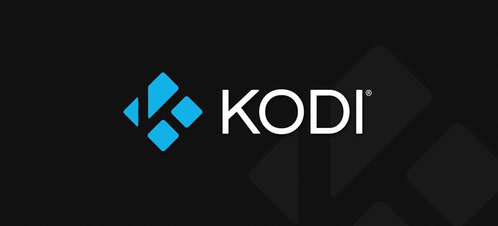

  <strong>
    <a href="https://kodi.tv/">website</a>
    •
    <a href="https://kodi.wiki/view/Main_Page">docs</a>
    •
    <a href="https://forum.kodi.tv/">community</a>
    •
    <a href="https://kodi.tv/addons">add-ons</a>
  </strong>

  
  
  
  
  
  

<h1 align="center">
  Welcome to Kodi Home Theater Software!
</h1>

Kodi is an award-winning **free and open source** software media player and entertainment hub for digital media. Available as a native application for **Android, Linux, BSD, macOS, iOS, tvOS and Windows operating systems**, Kodi runs on most common processor architectures.

Created in 2003 by a group of like minded programmers, Kodi is a non-profit project run by the XBMC Foundation and developed by volunteers located around the world. More than 500 software developers have contributed to Kodi to date, and 100-plus translators have worked to expand its reach, making it available in more than 70 languages.

While Kodi functions very well as a standard media player application for your computer, it has been designed to be the perfect companion for your HTPC. With its **beautiful interface and powerful skinning engine**, Kodi feels very natural to use from the couch with a remote control and is the ideal solution for your home theater.

## Give your media the love it deserves
Kodi can be used to play almost all popular audio and video formats around. It was designed for network playback, so you can stream your multimedia from anywhere in the house or directly from the internet using practically any protocol available.

Point Kodi to your media and watch it **scan and automagically create a personalized library** complete with box covers, descriptions, and fanart. There are playlist and slideshow functions, a weather forecast feature and many audio visualizations. Once installed, your computer or HTPC will become a fully functional multimedia jukebox.

  

## Getting Started
Kodi's developers work hard to make it support a large range of devices and operating systems. We provide final as well as development builds. To get started, head over to the **[downloads section](https://kodi.tv/download)** and simply select the platform that you want to install it on. A **[quick start guide](https://kodi.wiki/view/quick_start_guide)** to help you get acquainted with Kodi is available in our wiki.

## How to Contribute
Kodi is created by users for users and **we welcome every contribution**. There are no highly paid developers or poorly paid support personnel on the phones ready to take your call. There are only users who have seen a problem and done their best to fix it. This means Kodi will always need the contributions of users like you. How can you get involved?

* **Coding:** Developers can help Kodi by **[fixing a bug](https://github.com/xbmc/xbmc/issues)**, adding new features, making our technology smaller and faster and making development easier for others. Kodi's codebase consists mainly of C++ with small parts written in a variety of coding languages. Our add-ons mainly consist of python and XML. For more information, please have a look at our **[contributing guide](docs/CONTRIBUTING.md)**.
* **Helping users:** Our support process relies on enthusiastic contributors like you to help others get the most out of Kodi. The #1 priority is always answering questions in our **[support forums](https://forum.kodi.tv/)**. Everyday new people discover Kodi, and everyday they are virtually guaranteed to have questions.
* **Localization:** Translate **[Kodi](https://kodi.weblate.cloud/projects/kodi-core/kodi-main/)**, **[add-ons, skins etc.](https://kodi.weblate.cloud/)** into your native language.
* **Add-ons:** **[Add-ons](https://kodi.tv/addons)** are what make Kodi the most extensible and customizable entertainment hub available. **[Get started building an add-on](https://kodi.tv/create-an-addon)**.
* **Documentation:** Kodi's **[wiki pages](https://kodi.wiki/)** are the hub for information about Kodi and surrounding ecosystem. Help make our documentation better by writing new content or correcting existing material.

**Not enough free time?** No problem! There are other ways to help Kodi.

* **Spread the word:** Share Kodi with the world! Tell your friends and family about how Kodi creates an amazing entertainment experience. Stay up to date on the latest stories about Kodi reading our **[news](https://kodi.tv/blog)** section, follow us on **[Twitter](https://twitter.com/koditv)** and **[Facebook](https://www.facebook.com/XBMC/)**, or **star Kodi's repo** if you want to follow development.
* **Donate:** We are always happy to receive a **[donation](https://kodi.tv/contribute/donate)**. Donations are typically used for travel to attend conferences, any necessary paperwork and legal fees, and the yearly XBMC Foundation Developers Conference, where a great deal of coding and planning for the following year occurs. Donations may also be used to purchase necessary hardware and licenses for developers, along with t-shirts, stickers, and other accessories for conferences.
* **Buy Kodi merchandise:** Purchasing Kodi gear helps just as much as a donation, and you get something in return! Checkout our **[store](https://kodi.tv/store)** for Kodi branded gear. We regularly add new products so check back often.

## Building
Kodi uses CMake as its building system but instructions are highly dependent on your operating system and target platform. Fortunately **[we've got you covered](docs/README.md)**.

## Acknowledgements
Kodi couldn't exist without

* All the **[contributors](https://github.com/xbmc/xbmc/graphs/contributors)**. Big or small a change, it does make a difference.
* All the developers that write the fantastic **software and libraries** that Kodi uses. We stand on the shoulders of giants.
* Our **[fantastic community](https://forum.kodi.tv/)** for the never ending support, inspiration, feedback, and for keeping us on our toes when we screw up!
* **[Our sponsors](https://kodi.tv/sponsors)**. Without them, keeping a huge project like this alive would be next to impossible.

## License
Kodi is **[GPLv2 licensed](LICENSE.md)**. You may use, distribute and copy it under the license terms.

