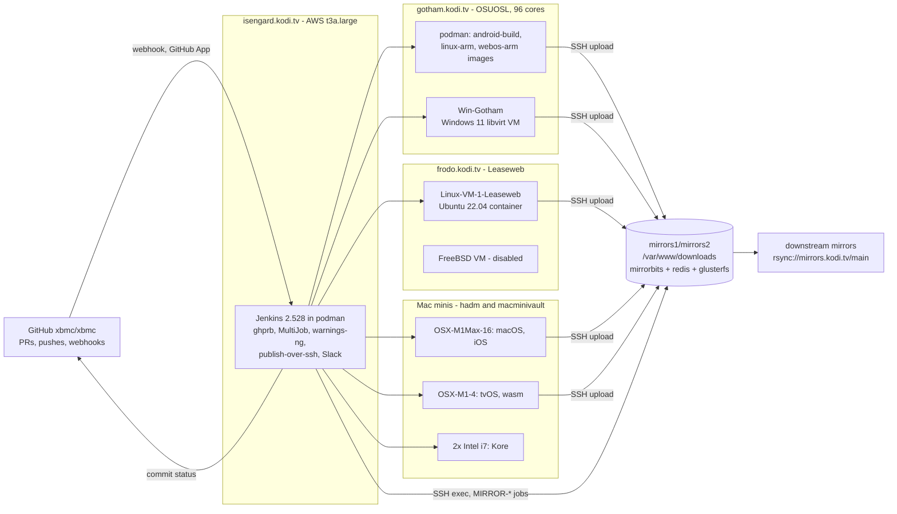
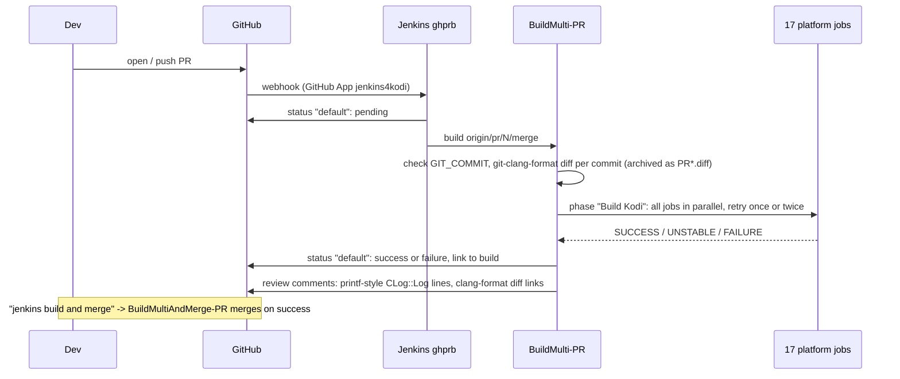
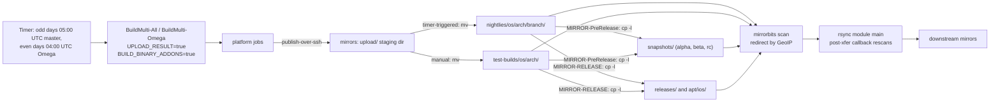
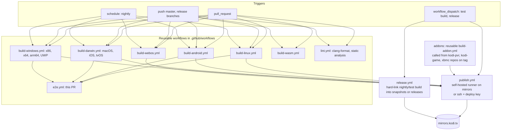

# Kodi CI: Jenkins today, GitHub Actions tomorrow

This document describes how Kodi's Jenkins CI works, proposes how to move it to GitHub
Actions, and lists what the GitHub Actions workflows in this repository still lack.

Sources: the live Jenkins instance (<https://jenkins.kodi.tv>, read through its JSON API and
console logs on 2026-09-13), the shared pipeline library
[xbmc/pipeline-library](https://github.com/xbmc/pipeline-library), the 2021 job backups in
[xbmc/kodi-jenkins-configs](https://github.com/xbmc/kodi-jenkins-configs), the server notes in
[xbmc/infrastructure](https://github.com/xbmc/infrastructure), and the in-tree scripts under
`tools/buildsteps/`. Freestyle job internals (triggers, phase lists, build steps,
publishers) were read from the live `config.xml` of each job with an admin token on
2026-09-13; the 2021 backups were only used to spot what changed since.

---

## 1. Jenkins today

### 1.1 Topology



| Node | Host | Labels | Executors | Builds |
| --- | --- | --- | --- | --- |
| gotham (podman) | gotham | `docker`, `docker-android`, `docker-linux`, `buildall` | 9 | Android x3, Linux x86_64/arm/arm64, webOS, MultiJob orchestrators |
| gotham-android-docker | gotham | `android-aarch64`, `android-armv7`, `androidx86` | 4 | Legacy freestyle Android jobs, Android-AAB |
| Win-Gotham | gotham (VM) | `win32`, `win64`, `winarm64`, `winUWP`, `upload` | 6 | All Windows and UWP jobs |
| Linux-VM-1-Leaseweb | frodo | `linux`, `linux-64-gl`, `linux-x11-static-analysis`, `linux-ppa` | 6 | `LINUX` freestyle, static analysis |
| OSX-M1Max-16-hadm | Mac mini | `osx-arm64`, `osx-x86_64`, `ios-aarch64` | 3 | macOS Intel and arm64, iOS |
| OSX-M1-4-macminivault | Mac mini | `tvos-aarch64`, `wasm`, `darwin_embedded` | 2 | tvOS, wasm |
| OSX-i7-1/2-macminivault | Intel Mac minis (macOS 10.15) | `android4kore`, `macOS-Intel-old-5` | 4+4 | Kore, test job |
| Freebsd | frodo (libvirt) | `Freebsd` | 1 | Disabled since 2026-03 |
| Built-In Node | isengard | `mirrorops` | 1 | MIRROR-* jobs, GitHub-ConflictChecker |

Toolchains live on the nodes: NDK 28.2 and the release keystore on gotham, Xcode 15.2 (and
26.0.1) plus the notarytool keychain profile on the Macs, VS2022 and the MSYS2 tree on
Win-Gotham, the webOS SDK buildroot and CLI on gotham. Dependency tarballs are cached per
node (`xbmc-tarballs`), and `tools/depends` is only rebuilt when its git tree hash changes
(`.last_success_revision` stamp, see `tools/buildsteps/defaultenv`).

### 1.2 Job families

| Family | Type | Jobs |
| --- | --- | --- |
| Orchestrators | MultiJob | `BuildMulti-PR`, `BuildMultiAndMerge-PR`, `BuildMultiWithAddons-PR`, `BuildMulti-PR-Manually`, `BuildMulti-All` (nightly), `BuildMulti-Choice`, `BuildMulti-Omega` (release branch) |
| Platform builds, freestyle | shell / batch steps calling `tools/buildsteps/<platform>/*` | `LINUX`, `OSX-64`, `OSX-ARM64`, `IOS-ARM64`, `TVOS`, `WIN-32`, `WIN-64`, `WIN-ARM64`, `WIN-UWP-64`, `WIN-UWP-32`, `WIN-UWP-ARM`, `wasm`, `Android-ARM64`, `Android-AAB` |
| Platform builds, pipeline | `buildKodi()` from xbmc/pipeline-library, in podman | `android-arm-docker`, `android-arm64-docker`, `android-x86-docker`, `linux-docker`, `webos-docker` |
| Binary add-ons | GitHub organization folders, `Jenkinsfile` = `buildPlugin(version: ...)` | `xbmc`, `kodi-pvr`, `kodi-game` (~250 add-on repositories) |
| Analysis | freestyle, timer | `LINUX-64-GL-Static-Analysis`, `iOS-ARM64-StaticAnalysis`, `WIN-64-CoverityScan`; `LINUX-64-GL-Coverage` and `LINUX-64-GL-CoverityScan` disabled |
| Release | freestyle on `mirrorops`, SSH exec | `MIRROR-PreRelease`, `MIRROR-RELEASE`, `MIRROR-OBB` (disabled) |
| Helpers | freestyle | `GitHub-ConflictChecker`, `Kore`, `BuildKore-PR` |
| Disabled or legacy | | `FreeBSD`, `Android-ARM`, `Android-X86`, `IOS`, `LINUX-64-GLES`, `LINUX_UBUNTU_PPA`, `BINARY-ADDONS*`, `BuildMulti-Leia/Matrix/Nexus`, per-developer organization folders |

### 1.3 Pull request flow



- **Trigger**: every PR from anyone (`permitAll`), on open and on push, via the GitHub Pull
  Request Builder plugin. Comment phrases: `jenkins build this please` (rebuild),
  `jenkins build and merge` (`BuildMultiAndMerge-PR`, merges the PR through the plugin on
  success), `jenkins build this with addons please` (`BuildMultiWithAddons-PR`, xbmc
  members only). `[skip ci]` in a commit message and the labels `No-Jenkins`, `No Jenkins`
  and `Stale` suppress builds.
- **Path filter**: changes limited to `.github/`, `docs/`, `addons/`, `system/*.xml`,
  `system/shaders/`, READMEs, `.clang-format` and `.gitignore` do not trigger.
- **What is built**: the GitHub merge ref (`refs/pull/N/merge`), so the PR is tested as
  merged into its target branch. Every release branch up to and including Nexus is
  blacklisted, so only `master`, `Omega` and `Piers` PRs build. Some legs are conditional
  on the target branch: WIN-ARM64 only for master, wasm not for Omega, OSX-ARM64 and webOS
  not for Nexus.
- **Throttling**: category `BuildMulti`, at most 3 orchestrators at once and 2 per node, one
  per `sha1`. A new push cancels the running build of the same PR. Each platform job has
  its own throttle (Windows: 2 in total, Apple: 1 per node, Linux: 4 per node).
- **Retry**: each platform job is retried once on failure, Apple jobs twice, with log
  parsing rules in `/var/jenkins_home/rules/failures.txt` deciding what counts as an
  infrastructure failure. The phase continues past UNSTABLE jobs; a FAILURE of the cross
  Linux legs kills the whole phase.
- **Result**: a single commit status named `default` with a link to the MultiJob build.
  Sub-job logs, JUnit results and warnings are only visible on jenkins.kodi.tv. Slack is
  notified on every result.
- **Automated review** (Groovy post-build step, posting as `jenkins4kodi`): a GitHub review
  with an inline comment on every added line matching `CLog::Log.*%` asking for `{}`
  formatting, and a PR comment linking the archived `git-clang-format` diffs when any
  commit is not formatted. Both delete their previous comments before posting.
- **Duration**: a healthy `BuildMulti-PR` run takes 40 to 55 minutes; when the dependency
  caches are cold it takes 2.5 hours, dominated by the Apple jobs. The queue is one build at
  a time per Mac label.
- **Retention**: 21 days / 200 builds for the orchestrator, 7 days / 35 builds for pipeline
  jobs.

### 1.4 Platform matrix (per PR)

`Configuration=Default` resolves per platform in `tools/buildsteps/defaultenv`: Debug on
Linux, macOS, iOS and tvOS; Release on Android, webOS and wasm. `BUILD_BINARY_ADDONS=false`
for PR builds. Freestyle jobs run the `prepare-depends`, `configure-depends`,
`make-depends`, `prepare-xbmc`, `configure-xbmc`, `make-xbmc`, `package`, `run-tests`
scripts of `tools/buildsteps/<platform>/`; the pipeline jobs implement the same sequence in
`buildKodi.groovy`.

| Job | Node | Toolchain / deps | Unit tests | Package produced | Extra checks |
| --- | --- | --- | --- | --- | --- |
| `linux-docker` x3 (`Linux_x86_64` gl, `Linux_x86_64` gles, `Linux_arm64` gles) | gotham, `kodi/jenkins/linux` image | `tools/depends`, `--with-toolchain=/usr` | x86_64 only (`kodi-test`, gtest XML, `TestNetwork.PingHost` excluded) | none | clang warnings, any warning in `xbmc/` fails |
| `LINUX` (`arm-linux-gnueabihf` gles, `aarch64-linux-gnu` gles, `CORE_PLATFORM_NAME=wayland gbm`) | Linux-VM-1-Leaseweb | `tools/depends` cross-compile | no (x86_64 only) | none | gcc warnings |
| `android-arm-docker`, `android-arm64-docker`, `android-x86-docker` | gotham, `kodi/jenkins/android-build` image | `tools/depends`, NDK 28.2 | no | signed APK (`kodi-<date>-<sha>-PR<n>-<abi>.apk`, release keystore) | clang warnings, any warning in `xbmc/` fails |
| `webos-docker` | gotham, `kodi/jenkins/webos-arm:1.3` | `tools/depends`, webOS buildroot | no | `.ipk` via `make ipk` and ares CLI | clang warnings, any warning in `xbmc/` fails |
| `OSX-64`, `OSX-ARM64` | OSX-M1Max-16 | `tools/depends`, Xcode 15.2, SDK 14.2 | yes (5116 tests, JUnit) | `.dmg`, notarised via `notarytool` keychain profile | clang warnings, budget of 5 in total |
| `IOS-ARM64` | OSX-M1Max-16 | `tools/depends`, iOS SDK 17.2, `CODE_SIGNING_ALLOWED=NO` | no | `.deb` + `.ipa` (CPack), dSYM kept on node | clang warnings minus `-Wshorten-64-to-32`, budget of 8 in total |
| `TVOS` | OSX-M1-4 | same, tvOS | no | `.deb` + `.ipa` | clang warnings |
| `WIN-32`, `WIN-64`, `WIN-ARM64` | Win-Gotham | prebuilt packages from `mirrors.kodi.tv/build-deps`, VS2022; MSYS2 ffmpeg build only for the Omega branch | yes on x86/x64 (`run-tests.bat`, xUnit GoogleTest) | NSIS `KodiSetup-*.exe` + `.pdb` | MSBuild warnings |
| `WIN-UWP-64` | Win-Gotham | same, UWP | no | `.msix` + `.appxsym` + `.cer` (all binary add-ons bundled) | MSBuild warnings |
| `wasm` | OSX-M1-4, emsdk 5.0.6 | `tools/depends` | no | none (package step is empty) | clang warnings |

Not run on PRs but present: `WIN-UWP-32` and `WIN-UWP-ARM` (failing, disabled in the
phase since 2025), `FreeBSD` (disabled), `iOS-ARM64-StaticAnalysis` (nightly and merge job
only). The pipeline jobs pass a `qualityGateTreshold` argument that the library reads as
`qualityGateThreshold`, so the intended budgets (5 for Linux and webOS, 6 for Android) are
ignored and the default of 1 applies.

### 1.5 Nightlies, test builds and releases



- **Nightlies** are `BuildMulti-All` (master, cron `0 5 1-31/2 * *`) and `BuildMulti-Omega`
  (Omega branch, cron `0 4 2-31/2 * *`) runs with `UPLOAD_RESULT=true` and binary add-ons
  enabled (`peripheral.joystick` for most platforms, `all` for iOS, tvOS and UWP). The
  same jobs started by hand put the files in `test-builds/` instead of
  `nightlies/<os>/<arch>/<branch>/`. `BuildMulti-Choice` and `BuildMulti-PR-Manually` build
  a selectable subset (`Build` parameter), optionally from a fork, and can upload a PR
  build to `test-builds/` for testers.
- **Upload path**: each job's publish-over-ssh step copies the package to an `upload/`
  directory on the mirrors server as the `jenkins` user, then runs a remote `mv` into the
  final directory (freestyle jobs) or `jenkins-move-kodi.sh <files> <folder>` (pipeline
  jobs). File names follow `kodi-<yyyymmdd>-<sha8>-<branch or PRn>-<arch>.<ext>`.
- **Layout on mirrors.kodi.tv**: `nightlies/`, `test-builds/`, `snapshots/`, `releases/`
  each with `android/{arm,arm64-v8a,x86}`, `darwin/{ios-arm64,tvos}`, `osx/{arm64,x86_64}`,
  `webos/`, `windows/{win32,win64,winarm64,uwp64,uwp32,uwp-arm}`; `releases/source/`;
  `addons/<codename>/` for binary add-ons; `build-deps/` for the Windows prebuilt
  dependencies and source tarballs used by `tools/depends`; `tools/kore/`.
- **Releases** are not builds. `MIRROR-PreRelease` (alpha/beta/rc into `snapshots/`) and
  `MIRROR-RELEASE` (into `releases/` and `apt/ios/deb/`) take a git hash and a codename and
  hard-link the matching files from `test-builds/` or `nightlies/` under the release name
  (`kodi-22.0-Piers-x64.exe`, `org.xbmc.kodi-ios_22.0_iphoneos-arm64.deb`). Release builds
  are therefore ordinary CI builds of the tagged commit. The iOS/tvOS release `.deb` also
  feeds the apt repository for jailbroken devices. Store submissions (Microsoft Store,
  Google Play from the signed `.aab` of `Android-AAB`) and Flatpak, Snap and PPA packaging
  happen outside Jenkins.
- **Mirrorbits** (fork at xbmc/mirrorbits) runs on mirrors1/mirrors2 behind nginx and
  keepalived, with redis and a glusterfs-shared `/var/www/downloads`. It rescans the tree
  after uploads, redirects downloads by GeoIP/ASN, and disables mirrors that fall out of
  sync. Downstream mirrors (dozens, allow-listed by IP in `rsyncd.conf`) pull
  `rsync://mirrors.kodi.tv/main`; a post-transfer hook tells mirrorbits to rescan. Files must be owned
  `jenkins-addons:www-data` mode 0644 or downstream syncs break.

### 1.6 Binary add-ons

Three GitHub organization folders (`xbmc`, `kodi-pvr`, `kodi-game`) scan every 12 hours for
repositories with a `Jenkinsfile`, which is one line: `buildPlugin(version: "Piers")`. Every
branch and tag gets a job; the current development branch also builds weekly.
`buildPlugin.groovy` checks out `xbmc/xbmc` at the matching branch, runs the platform's
`prepare-depends` / `configure-depends` / `make-native-depends` (or
`download-dependencies.bat` on Windows), builds the add-on through
`tools/depends/target/binary-addons` with `PACKAGE_ZIP=ON`, archives the zip, and on a **tag**
uploads it to `addons/<codename>/<addon>+<platform>/` on the mirrors via
`jenkins-move-addons.sh`. Deploy platforms: android-armv7, android-aarch64, osx-x86_64,
osx-arm64, windows-i686, windows-x86_64, windows-arm64. iOS and tvOS are built for
verification only (their add-ons ship inside the app). Linux users get add-ons from
distributions. One build per platform and version at a time (throttle categories); Slack
`#buildserver-addons` is notified per platform.

The add-on repositories already run GitHub Actions of their own: a Linux gcc/clang build on
push and PR (`build.yml`, checking out `xbmc/xbmc` master and using `cmake/addons`), a
`workflow_dispatch` release workflow that tags and creates a GitHub release from
`addon.xml.in`, and translation sync. Jenkins reacts to that tag to build and deploy.

### 1.7 Quality gates

| Gate | Where | Blocking? |
| --- | --- | --- |
| Compiles on 17 configurations, PR merged into target | `BuildMulti-PR` | Yes (status `default`) |
| gtest unit tests (5100+) | Linux x86_64 gl and gles, macOS Intel and arm64, Windows x86 and x64 | Yes: a failed test marks the job UNSTABLE, which fails the PR status |
| Compiler warnings (warnings-ng: clang, gcc, MSBuild) | every platform job, filtered to `xbmc/`, excluding `tools/depends/` | Pipeline jobs (Linux, Android, webOS): one warning fails the build. macOS and iOS: total budgets of 5 and 8, currently at 3 and 7. `LINUX` and Windows: recorded only |
| clang-format | `BuildMulti-PR` pre-step, `git-clang-format --diff` per commit | No: diffs archived and linked in a bot comment on the PR |
| printf-style logging (`CLog::Log(...%...)`) | `BuildMulti-PR` post-build Groovy, inline GitHub review comments | No: comment only |
| Binary add-on build status | when `BUILD_BINARY_ADDONS=true`, `.success` / `.failure` marker files | Marks UNSTABLE, not fatal |
| clang-tidy + cppcheck | `LINUX-64-GL-Static-Analysis`, every 3 days, `CORE_PLATFORM_NAME="x11 wayland gbm"`, `analyze-clang-tidy` and `analyze-cppcheck` targets, `lib/libUPnP` excluded, Slack `#core` | No; has failed since 2025-11 |
| Full clang warning inventory (~630) | `iOS-ARM64-StaticAnalysis`, nightly and merge job | No |
| Coverity | `WIN-64-CoverityScan` every 4 days, `cov-build` around the VS2022 build, upload to scan.coverity.com (never succeeded); `LINUX-64-GL-CoverityScan` disabled | No |
| Coverage | `LINUX-64-GL-Coverage` (disabled) | No |
| SonarQube | GitHub Actions, push to master | No |
| Merge hygiene (milestone, version label, no WIP/RFC) | Mergeable bot, `.github/mergeable.yml` | Yes (status `Mergeable`) |
| Merge conflicts | `GitHub-ConflictChecker` on every push to master: labels `Rebase needed` and comments on unmergeable PRs, also fast-forwards the bot's forks | Informational |

### 1.8 Other jobs and what is already on GitHub Actions

- `Kore` builds the Android remote on an Intel Mac mini every two days, uploading to
  `tools/kore/{nightlies,test-builds,releases}`.
- `Android-AAB` builds the Play Store bundle on demand (last run 2026-06).
- `LINUX_UBUNTU_PPA` / `BuildMulti-Addons-PPA` (Launchpad uploads) are disabled and were
  never run; the team PPA is maintained outside Jenkins.
- GitHub Actions in `xbmc/xbmc` master today: Doxygen publish to docs.kodi.tv, SonarQube
  scan, Weblate source upload, add-on metadata translation sync, stale issue closer. None
  builds Kodi.

### 1.9 Weaknesses worth fixing during a migration

- Single opaque status per PR; per-platform results, logs, test reports and clang-format
  diffs require a Jenkins account or link hopping.
- Freestyle job configuration lives only in Jenkins (the backup repository is from 2021)
  and mixes three generations: freestyle scripts, `buildKodi` pipeline, `buildPlugin`.
- Long-lived mutable workspaces and stamp files make builds fast but state-dependent
  (`git clean` exclusions, `.last_success_revision`, per-node tarball caches).
- Apple builds serialise on two Mac minis and dominate PR latency; macOS 10.15 minis run
  Xcode 10.
- Static analysis, coverage and Coverity have been broken or disabled for months and nobody
  is alerted.
- Signing material is split between Jenkins credentials (Apple developer certificate,
  notarytool API key, Android keystore password) and node disks (the Android keystore
  file on gotham). The Windows Coverity job carries its scan.coverity.com token and the
  submitter's e-mail in plain text inside the job configuration.
- The GitHub Pull Request Builder plugin (`ghprb` 1.42.2) that drives the whole PR flow is
  no longer maintained upstream.
- Two prototypes of a pipeline rewrite (`Test-macos-pipeline`, `docker-pipeline` pointing
  at a personal fork) show the freestyle jobs were already meant to be replaced.

---

## 2. Migrating to GitHub Actions

### 2.1 Concept mapping

| Jenkins | GitHub Actions equivalent |
| --- | --- |
| ghprb trigger on PR open/push, `permitAll` | `pull_request` event; forks get read-only `GITHUB_TOKEN`, no secrets |
| `origin/pr/N/merge` | `pull_request` checks out the merge commit by default |
| Comment phrases (`jenkins build this please`) | Re-run button, `workflow_dispatch`, or an `issue_comment` workflow for opt-in extras (build with add-ons, upload test build) |
| `[skip ci]`, `No-Jenkins` label, excluded regions | `[skip ci]` is native; `paths-ignore` on the workflow; label check in a job `if:` |
| MultiJob phase with retry, throttle | Matrix jobs, `concurrency` groups, `nick-fields/retry` or job-level rerun-failed |
| Single status `default` | One check per job; branch protection selects the required ones |
| `BuildMultiAndMerge-PR` (bot merge) | Branch protection + merge queue, or auto-merge |
| Timer nightlies, `UPLOAD_RESULT` | `schedule` workflow with a `publish` job; `workflow_dispatch` inputs replace `BuildMulti-Choice` |
| publish-over-ssh to mirrors | A publish job running `rsync`/`ssh` with a deploy key from GitHub secrets, or a self-hosted runner on the mirrors host |
| MIRROR-PreRelease / MIRROR-RELEASE | `workflow_dispatch` release workflow with inputs (hash, codename, version, platforms) running the same `cp -l` script over SSH |
| Organization folders + `Jenkinsfile` | A reusable workflow in `xbmc/xbmc` (`workflow_call`) invoked from each add-on repository on tag; or one workflow in `repo-binary-addons` triggered by `repository_dispatch` |
| warnings-ng, JUnit, xUnit | Problem matchers plus a test-report action (`EnricoMi/publish-unit-test-result-action`, `dorny/test-reporter`) writing to the job summary |
| Slack notifier | `slackapi/slack-github-action` on failure of scheduled runs |
| Node labels, per-node caches | `runs-on`, `actions/cache` (10 GB per repository by default, 7 days idle eviction), or self-hosted runners with persistent disks |

### 2.2 Target architecture



Design rules:

1. **One workflow per platform, split into `build` and `test` jobs**, as this PR already
   does. Build artifacts are uploaded once and consumed by unit tests, E2E and publishing.
2. **Keep `tools/buildsteps/` as the single build recipe.** Workflows call the same scripts
   Jenkins does, so both systems can run side by side during the transition, and the
   Jenkins configuration stops being the only place the build is described.
3. **Per-platform required checks** instead of one `default` status, with the flaky or
   slow legs (Apple, wasm) informational at first.
4. **Nightly and release publishing separated from building.** Any successful build
   artifact can be promoted; the promotion job is the only one holding mirror credentials.
5. **Secrets never reach fork PRs.** Signing (Android keystore, Apple notarisation, Windows
   Authenticode if added) happens only in `push`/`schedule` runs or in the publish job.

### 2.3 Runners

| Platform | Hosted runner feasibility | Recommendation |
| --- | --- | --- |
| Linux x86_64 (gl, gles, X11, Wayland, GBM), cross arm/arm64 | Good. `ubuntu-24.04`, 4 vCPU; `ubuntu-24.04-arm` exists for native arm64 | Hosted. Cache `tools/depends` and ccache as this PR does. Use a container image (`ghcr.io/xbmc/...`) to pin the toolchain like the podman images do today |
| Android arm, arm64, x86 | Good, NDK on the image | Hosted; PR builds unsigned or debug-keystore signed, nightly signed in a `push`-only job with the keystore from secrets |
| webOS | Feasible: SDK buildroot must be downloaded (licence terms to check) | Hosted, container image with the buildroot |
| macOS x86_64 and arm64 | `macos-14`/`macos-15` arm64 are hosted; GitHub no longer offers Intel macOS runners. Team plan: 5 concurrent macOS jobs | Hosted for arm64; keep one Mac mini as a self-hosted runner for the Intel build and for notarisation |
| iOS, tvOS device builds | Hosted arm64 Macs with Xcode | Hosted; dSYM upload as artifact instead of node-local |
| Windows x86, x64, arm64, UWP | `windows-2022`, prebuilt deps from mirrors; ~25 min today on a 48-thread VM, expect 45 to 90 min on 4 vCPU | Hosted for PRs if time is acceptable, else self-hosted on Win-Gotham with the GitHub runner agent |
| wasm | Linux with emsdk | Hosted, move off the Mac |
| FreeBSD | No hosted runner | `vmactions/freebsd-vm` (slow) or drop, as Jenkins effectively has |
| Publishing | Needs SSH to mirrors | Self-hosted runner on mirrors1 (label `mirrors`) restricted to `publish.yml`, or a deploy key with a forced command |

The xbmc organization is on the GitHub Team plan (60 concurrent jobs, 5 macOS). Hosted
runner minutes are free for public repositories. Both gotham and the Mac minis can be
registered as self-hosted runners in a runner group limited to `xbmc/xbmc` to reuse
existing hardware and caches; the podman images already used by `buildKodi` can run
unchanged under `container:`.

### 2.4 Publishing and release

- `publish.yml` (reusable, `workflow_call`, secrets `MIRRORS_SSH_KEY`): download the
  platform artifacts, rename to the Jenkins file scheme, `rsync` into `upload/`, then run
  `jenkins-move-kodi.sh <files> nightlies/<os>/<arch>/<branch>` or `test-builds/...` over
  SSH. The remote scripts and permissions stay as they are, so mirrorbits and the downstream
  mirrors see no difference.
- `nightly.yml`: `schedule` plus `workflow_dispatch`, calls each build workflow with
  `upload: true` and `binary_addons: true`, then `publish.yml`. Replaces `BuildMulti-All`,
  `BuildMulti-Omega`, `BuildMulti-Choice` and the `UPLOAD_RESULT` parameter.
- `testbuild.yml`: `workflow_dispatch` with a PR number and platform list (or an
  `issue_comment` trigger restricted to team members) that builds `refs/pull/N/merge` and
  publishes to `test-builds/`. Replaces `BuildMulti-PR-Manually`.
- `release.yml`: `workflow_dispatch` with hash, codename, version, release type and
  platform checkboxes; runs the `cp -l` logic of `MIRROR-PreRelease` / `MIRROR-RELEASE`
  over SSH and creates the git tag. Requires an `environment: release` with required
  reviewers.
- Signing: Android release keystore and password in environment secrets; Apple signing
  certificate and notarytool API key in secrets (`security import` in the job); no Windows
  signing exists today.

### 2.5 Binary add-ons

- `.github/workflows/build-addon.yml` is the reusable workflow replacing `buildPlugin`:
  inputs `addon`, `addon_repository`/`addon_ref` (default: the caller), `kodi_repository`/
  `kodi_ref` (default `xbmc/xbmc` master) and a JSON `platforms` list defaulting to the
  seven Jenkins deploy platforms plus `ios-aarch64` and `tvos-aarch64`. Per platform it
  checks out Kodi, builds and caches the `tools/depends` native tools on the tree hash,
  writes the one-line add-on definition, builds with `PACKAGE_ZIP=ON` (`make-addons.bat
  package` on Windows) and uploads `<addon>-<platform>` zip artifacts. A failed add-on
  fails the job, unlike the main app legs where it is a warning. An add-on repository
  calls it with:

  ```yaml
  jobs:
    build:
      uses: xbmc/xbmc/.github/workflows/build-addon.yml@master
      with:
        addon: pvr.hts
        kodi_ref: master
  ```

  `ci.yml` calls it for `peripheral.joystick` on one platform per code path whenever the
  add-on build system or the workflow changes.
- Still to do: a `deploy` job on tags that publishes the zips to
  `addons/<codename>/<addon>+<platform>/` through `jenkins-move-addons.sh`, and the
  template caller workflow to roll out to the `xbmc`, `kodi-pvr` and `kodi-game`
  repositories in place of the `Jenkinsfile`. The existing `release.yml` in the add-on
  repositories already creates the tag, so the chain stays: dispatch release, tag, build,
  deploy. The mirrors' `addons/` layout and the repository add-on consuming it are
  unchanged.

### 2.6 Suggested phases

1. **Shadow**: land this PR's build workflows as non-required checks; compare failures with
   Jenkins for a few weeks; add the missing platforms (section 3).
2. **Gate**: make Linux, Android and Windows required; keep Apple informational until
   runner capacity is proven; turn off `BuildMulti-PR` status reporting.
3. **Nightlies**: `nightly.yml` publishes to `test-builds/` in parallel with Jenkins, then
   takes over `nightlies/`.
4. **Add-ons**: migrate one add-on organization (`kodi-pvr`) end to end, then the rest.
5. **Release and retire**: run one release cycle through `release.yml`, then decommission
   Jenkins and keep gotham/Macs as self-hosted runners only where hosted runners fall short.

---

## 3. What this PR covers and what is missing

This branch adds `ci.yml` as the single entry point for pull requests and master pushes,
which calls `e2e-linux.yml` (GBM, Wayland and X11, five legs), `apple.yml` (macOS, the
iOS/tvOS Simulator and the iOS/tvOS device builds, five legs), `e2e-android.yml`,
`e2e-windows.yml`, `build-webos.yml`, `lint.yml`, `static-analysis.yml` and the reusable
`build-addon.yml`; plus `coverity.yml` and `coverage.yml` on their own schedules,
`merge-conflicts.yml` on master pushes and pull request updates, shared composite
actions for ccache, `tools/depends` caching, binary add-ons and unit test
reports, the pytest E2E driver under `tools/e2e/`, and `docs/E2E-TESTING.md`. The
platforms that share almost all of their build/test steps are matrix legs of one
workflow file rather than separate files, so a step common to several legs (a cache
key, an environment fix) is fixed once.

### 3.1 Coverage against Jenkins

| Jenkins capability | This PR | Gap |
| --- | --- | --- |
| Linux x86_64 build (gl + gles) | Yes: GBM gles, Wayland gles, X11 gl against Ubuntu packages, CPack `.deb` | Not built through `tools/depends` (deliberately: the distro-package path is what users build); X11 pinned to Ubuntu 22.04 |
| Linux arm / arm64 cross builds | arm64: yes, native on `ubuntu-26.04-arm` (GBM and Wayland, with E2E) | 32-bit arm not built |
| Android arm64, arm, x86 | Yes: release APKs for arm64-v8a, armeabi-v7a and x86 plus the x86_64 debug APK for the emulator; release keystore from secrets on non-PR runs | AAB |
| webOS | Yes: `build-webos.yml`, buildroot-nc4 toolchain, `.ipk` | No device or emulator test |
| macOS arm64 | Yes: `tools/depends`, Kodi.app, unit tests, `.dmg`, signing and notarisation from secrets on non-PR runs | No Intel build (dropped: GitHub has no Intel macOS runners) |
| iOS / tvOS device | Yes: `apple.yml`'s device legs, unsigned `.ipa` and dSYM artifacts; Simulator legs of the same workflow for E2E | No `.deb` (dropped: only needed for the jailbreak apt repository) |
| Windows x64 | Yes: x64, Win32, ARM64 and UWP x64 through `BuildSetup.bat`, NSIS installer and `.pdb`, `.msix`, unit tests on x64 and Win32 | Visual Studio generator, so no ccache; a CPack NSIS port would need Windows `install()` rules first |
| wasm | No | Low priority; Jenkins job produces nothing |
| FreeBSD | No | Disabled in Jenkins too |
| Unit tests | Every leg that can execute its binary: Linux GBM, Wayland and X11 on x86_64 and arm64, macOS, Windows x64 and Win32; gtest XML summarised with inline annotations per failure | Android, iOS, tvOS and webOS cannot run them on the runner, as on Jenkins |
| Compiler warning tracking with thresholds | No (deferred) | Parse compiler output per leg, annotate, per-leg budgets, later a baseline comparison against master |
| clang-format diff per commit, bot comment with diff links | Yes: `lint.yml` runs `git clang-format` per commit, uploads the diffs and fails the check | Bot comment replaced by the failing check and the summary |
| Inline review comments on printf-style `CLog::Log` | Yes: `lint.yml` annotates added `CLog::Log(...%...)` lines | Advisory, as on Jenkins |
| clang-tidy / cppcheck | Yes: `static-analysis.yml`, clang-tidy on the changed lines of every PR (annotations), full `analyze-clang-tidy` and `analyze-cppcheck` on master pushes uploaded to code scanning as SARIF | Advisory on PRs |
| Coverity / coverage | Yes: `coverity.yml` weekly (token and e-mail from secrets, skipped when absent), `coverage.yml` on master pushes with the Cobertura report as artifact and a summary | No coverage service integration |
| Binary add-ons built with Kodi | Yes: `peripheral.joystick` on every leg, failure reported as a warning like Jenkins | Full add-on set for UWP, iOS and tvOS nightlies |
| Binary add-on repositories (`buildPlugin`) | Yes: reusable `build-addon.yml` on nine platforms, exercised from `ci.yml` | Deploy-on-tag job and roll-out to the add-on repositories |
| Nightly schedule and upload to mirrors | No | `nightly.yml` + `publish.yml`, file naming scheme, SSH secret or self-hosted runner |
| Test builds on request (`BuildMulti-PR-Manually`, `UPLOAD_RESULT`) | No | `workflow_dispatch` or comment trigger |
| Release promotion (`MIRROR-*`) | No | `release.yml` |
| Build-and-merge phrase | No | Branch protection / merge queue |
| Path-based skip, `No-Jenkins` / `Stale` labels, target-branch conditions | Yes, once, in `ci.yml`: `paths-ignore` for docs, Markdown and the non-workflow `.github/` files; a gate job skips every build on drafts and on the `No-Jenkins`, `No Jenkins` and `Stale` labels, and skipped jobs count as passed for branch protection | Narrower than Jenkins on purpose: `addons/`, `system/*.xml` and `system/shaders/` now change E2E results, so they trigger. No per-branch leg conditions yet |
| PR draft handling | Yes: drafts skipped, `ready_for_review` starts | Jenkins has no equivalent |
| Cancel superseded runs | Yes: `concurrency` with `cancel-in-progress` | |
| Dependency and ccache caching | Yes: `tools/depends` cached by tree hash, ccache saved from master only | Cache size against the 10 GB limit with 8 platforms needs measuring |
| Retry infrastructure failures | Not needed: the dependency downloads retry inside CMake and the emulator action retries its boot | |
| Slack notification | No | Add to scheduled workflows on failure |
| Kore | No | Trivial Gradle workflow in `xbmc/Kore` |
| Conflict checker | Yes: `merge-conflicts.yml` labels `Rebase needed` and comments once per conflict, as `GitHub-ConflictChecker` did | Also runs when a pull request is updated, which Jenkins did not; the comment cannot @mention the author |

### 3.2 What this PR adds that Jenkins never had

- Launching the built binary on eight platforms and driving it over JSON-RPC (startup,
  render, navigation, settings persistence, clean shutdown), with screenshots and logs
  uploaded per run.
- Installing the Linux `.deb` packages that CPack produces and testing the installed
  binary, which validates packaging as well as the build.
- Simulator builds for iOS and tvOS, which Jenkins does not exercise.

### 3.3 Priorities to close the gap

1. Add **`nightly.yml` and `publish.yml`** so GitHub can feed `test-builds/` and
   `nightlies/` and Jenkins can be retired for nightlies.
2. Add the **add-on deploy** job and roll the reusable workflow out to the add-on repositories.
3. Add **compiler warning tracking** (per-leg budgets, then a baseline against master).
4. Decide **gating**: which jobs become required, and whether the Windows legs (Visual
   Studio generator on a 4-vCPU runner) and the Apple legs stay hosted or move to
   self-hosted runners.

## 4. Open questions for the team

- Are the `jenkins-move-kodi.sh` / `jenkins-move-addons.sh` scripts and the mirrors upload
  account acceptable to drive from GitHub (deploy key in secrets), or must publishing stay
  on team-controlled hardware (self-hosted runner on mirrors1 or gotham)?
- Is the `refs/pull/N/merge`-of-forks model with secrets withheld acceptable for Android and
  Apple signing, meaning PR builds are unsigned and only `push`/nightly builds are signed?
- Should gotham and the Mac minis become self-hosted runners (keeping the 48-thread Windows
  VM and the warm dependency caches), or is the goal to run entirely on hosted runners?
- Who owns the currently broken analysis jobs (static analysis, Coverity), and should they
  be migrated or dropped?
