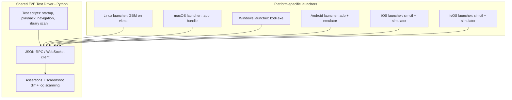

# Proposal: Multi-Platform End-to-End Testing for Kodi

> Status: proposal, with an initial slice implemented. This document
> describes a plan for adding end-to-end (E2E) test coverage to Kodi.
>
> A minimal first slice (build from source on GitHub Actions, launch, JSON-RPC ping,
> a basic screenshot sanity check, clean quit) now exists at [tools/e2e](../tools/e2e),
> covering eight platforms across six CI workflows: macOS
> ([.github/workflows/e2e-macos.yml](../.github/workflows/e2e-macos.yml)),
> three Linux windowing backends - GBM on a virtual KMS display
> ([.github/workflows/e2e-linux.yml](../.github/workflows/e2e-linux.yml)),
> Wayland under a headless Weston compositor
> ([.github/workflows/e2e-linux.yml](../.github/workflows/e2e-linux.yml)),
> and X11 under Xvfb, the only one of the three built with real desktop
> OpenGL/GLX rather than GLES/EGL
> ([.github/workflows/e2e-linux-x11.yml](../.github/workflows/e2e-linux-x11.yml))
> - GBM is the most representative of the three, matching how Kodi set-top
> deployments run with no compositor at all, while Wayland and X11 cover Kodi running
> as a client under a compositor/display server. All three build against Ubuntu's
> own system packages (per docs/README.Linux.md) rather than tools/depends, which on
> Linux exists to smoke-test its own recipes and support platforms with no usable
> system libs, not as the way a real Linux build is maintained - so they test what a
> real Ubuntu user's build looks like. Anything the distro ships too old for this
> tree is built via ExternalProject instead, as it would be for any user on that
> release: ffmpeg everywhere (Kodi requires >= 7.0), and rather more on X11, which
> runs on 22.04 because it is the last Ubuntu carrying a header its windowing code
> needs. X11 is also the only one built for desktop GL/GLX rather than GLES, which is
> why it has its own workflow rather than a third leg of the GBM/Wayland matrix.
> Android on a
> hardware-accelerated emulator
> ([.github/workflows/e2e-android.yml](../.github/workflows/e2e-android.yml)),
> Windows ([.github/workflows/e2e-windows.yml](../.github/workflows/e2e-windows.yml)),
> which reuses the same desktop launcher as macOS/Linux (`kodi.exe` supports
> `-p`/`--portable` the same way), and iOS / tvOS on a Simulator
> ([.github/workflows/e2e-apple-simulator.yml](../.github/workflows/e2e-apple-simulator.yml),
> [.github/workflows/e2e-apple-simulator.yml](../.github/workflows/e2e-apple-simulator.yml)).
> Both build against tools/depends' `--with-platform=ios-simulator`/`tvos-simulator`
> cases. Those Simulator ABIs are far less exercised than the device ones, so treat
> both jobs as less proven than the others, whose build configurations were already
> well-travelled before their E2E job existed.
> It is intentionally narrow in scope (see
> [tools/e2e/README.md](../tools/e2e/README.md) for exactly what it does and doesn't
> cover) and is not yet wired into required PR checks. The rest of this document
> remains the broader plan this is the first step of.

## Current state

- `xbmc/test/` contains a [gtest](https://github.com/google/googletest)-based unit test
  suite (see `xbmc/test/CMakeLists.txt`, `core_add_test_library(xbmc_test)`). These tests
  exercise isolated classes (`TestURL.cpp`, `TestFileItem.cpp`, `TestDateTime.cpp`, etc.)
  in-process; they do not launch or drive the running application.
- `.github/workflows/` currently only contains `documentation-creation.yml`,
  `sonarqube.yml`, `gh-action-weblate-upload.yml`, and `stale.yml`. There is no
  build-and-run test workflow and no UI-automation tooling (no Appium, Selenium, or
  similar) anywhere in the tree.
- **There is no end-to-end, functional, or visual-regression test infrastructure in the
  repository today.** This document proposes adding one.

## Why Kodi is well-suited for E2E automation

Kodi already exposes the pieces needed to build E2E tests without inventing new
instrumentation:

- A **JSON-RPC control API** over HTTP/WebSocket
  (`xbmc/interfaces/json-rpc/JSONRPC.cpp`, methods declared in
  `xbmc/interfaces/json-rpc/schema/methods.json`) exposing `Player.*`, `Input.*`,
  `GUI.*`, `Application.Quit`, `Files.*`, `VideoLibrary.Scan`, etc., plus event
  notifications (`Player.OnPlay`, `Player.OnStop`, `System.OnQuit`).
- A **cross-platform screenshot mechanism** (`xbmc/utils/Screenshot.h`, with per-backend
  implementations in `xbmc/rendering/gl`, `xbmc/rendering/gles`, and
  `xbmc/rendering/dx`), reachable through the `TakeScreenshot` built-in
  (`xbmc/interfaces/builtins/GUIBuiltins.cpp`).

Because the JSON-RPC/webserver interface is available on every platform Kodi runs on,
**a single test driver can work across platforms**, rather than needing a bespoke
UI-automation stack per OS. This is the central idea behind the design below.

## Design principle: one driver, many launchers

Each launcher's only job is to start Kodi with a disposable profile and test-media set,
wait for the webserver port to come up, hand control to the shared driver, then tear
down and collect logs/screenshots as CI artifacts on failure.

## Framework choices: reuse, don't reinvent

Only one layer of this stack is genuinely Kodi/platform-specific and needs custom code;
everything else should reuse existing, maintained libraries:

| Layer | Reuse | Why not build from scratch |
|---|---|---|
| JSON-RPC protocol client | `jsonrpc-async` / `jsonrpc-websocket` (PyPI, by emlove) | Generic, small, actively maintained asyncio JSON-RPC clients that already handle request/response correlation, batching, and reconnect. `pykodi` (PyPI) is a thin Kodi-flavored wrapper built on the same two libraries and can be used directly for common calls, falling back to raw JSON-RPC calls for methods it doesn't wrap. |
| Test orchestration/runner | `pytest` | Mature fixture system (ideal for launch/teardown of Kodi), parametrization for running the same scenario across fixture media files, JUnit XML output for CI, plugins like `pytest-rerunfailures` for flaky-hardware retries. |
| Process/platform launcher | Custom, small (`launcher.py`) | Nothing generic knows how to start a Kodi portable profile with a null audio device on Linux vs. launch a macOS `.app` bundle vs. spawn `kodi.exe` on Windows. Stays a few hundred lines of subprocess glue, not a framework. |
| Visual/screenshot diff (Phase 2) | `scikit-image` (SSIM) or `pixelmatch`, plus `pytest-mpl`/`syrupy` for baseline management | Perceptual image diffing with tolerance thresholds is a solved problem. |
| Mobile/tvOS OS-chrome automation (Phase 2) | Appium | Industry-standard cross-platform (Android + iOS/tvOS) UI automation with a single WebDriver-based API; only needed for OS-level concerns JSON-RPC can't reach (permission dialogs, PiP, backgrounding). |
| CI orchestration | GitHub Actions (already used in this repo) | No new CI system needed. |

Net effect: the only new code this plan requires writing is the Kodi-specific test
**scenarios** (what to click/play/assert) and the thin per-OS **launcher** — not a
testing framework itself.

## Phase 1: Linux, macOS, Windows desktop

### 1. Test content and disposable profile

- Add a small `tools/e2e/media/` fixture set: a few seconds each of h264/mp4, hevc/mkv,
  aac/flac audio, and one `.srt` subtitle file — kept intentionally tiny to limit CI
  checkout size.
- Generate a throwaway `userdata` profile per run (temp dir passed via `--portable` or
  equivalent) with:
  - webserver enabled on a fixed port, with a fixed test credential, seeded into the
    temp profile's `advancedsettings.xml`/`guisettings.xml` before launch.
  - the fixture media folder added as a source.
  - audio output forced to a null/dummy device so CI hosts without audio hardware don't
    hang.

### 2. Shared Python driver (`tools/e2e/driver/`)

- `kodi_client.py`: thin wrapper around `jsonrpc-websocket`/`pykodi` (connect, call,
  wait_for_notification with timeout) — not a hand-rolled JSON-RPC implementation.
- `launcher.py`: platform-specific subprocess launch/kill and readiness polling (port
  open) — one small class per OS, selected via `platform.system()`. This is the one
  piece of genuinely custom code in the stack.
- `scenarios/`: individual test scenarios as `pytest` tests, for example:
  - `test_startup.py` — launch, wait for the home screen to be reachable
    (`GUI.GetProperties` responds), clean `Application.Quit`, verify exit code 0 and no
    `FATAL`/crash lines in the log.
  - `test_playback.py` — `Player.Open` each fixture file, poll `Player.GetProperties`
    for `speed`/`time` increasing, `Player.Stop`, assert the `Player.OnStop`
    notification is received.
  - `test_navigation.py` — `Input.Down`/`Input.Select` sequences to walk into Settings
    and back, asserting `GUI.GetProperties(currentwindow)` changes as expected.
  - `test_library_scan.py` — add a local video source, `VideoLibrary.Scan`, wait for
    `VideoLibrary.OnScanFinished`, assert `VideoLibrary.GetMovies` returns the fixture
    item.
- Use `pytest` as the runner so results integrate with standard CI test reporting
  (JUnit XML output).

### 3. Log and crash capture

- Always upload the Kodi log file and, on failure, a screenshot (via the
  `TakeScreenshot` built-in) as CI artifacts.
- Treat a nonzero exit code, a crash-dump file being created, or `FATAL`/sanitizer-report
  patterns in the log as an automatic scenario failure even if the JSON-RPC calls
  "succeeded."

### 4. CI wiring

New workflow `.github/workflows/e2e-tests.yml`:

- `linux` job: build the GBM backend against system packages on a hosted Ubuntu
  runner and run on a virtual KMS device (`modprobe vkms`, Mesa `kms_swrast`
  software rendering) — no display server needed, and it exercises the real
  DRM/GBM/EGL windowing code rather than an X11 path under Xvfb. Upload
  logs/screenshots.
- `macos` job: build on `macos-latest`, launch the `.app` bundle directly (a real
  display is available on GitHub-hosted macOS runners — no headless wrapper needed),
  run the reduced smoke subset (startup, playback, quit) since full navigation
  scripting is more fragile around macOS window-focus behavior.
- `windows` job: build on `windows-latest`, launch `kodi.exe`, same reduced smoke
  subset as macOS.
- Run on PRs touching core playback/UI/JSON-RPC paths and on merge to master; keep the
  Linux job mandatory/blocking first, treat macOS/Windows as informational
  (`continue-on-error: true`) until proven stable, then promote to blocking.

### 5. What Phase 1 deliberately leaves out

- No visual/pixel regression diffing yet (fonts/GL differ enough across runners to
  need a tolerant baseline system — proposed for Phase 2).
- No add-on install/repo testing yet (needs a local mock add-on repo server).
- No PVR/live-TV or UPnP/SMB network source testing yet (needs a mock backend/test
  server container).

## Phase 2 (future): mobile and embedded

Once Phase 1 is stable, extend the same JSON-RPC driver to additional platforms:

- **Android**: implemented ahead of the rest of Phase 2 - see
  [.github/workflows/e2e-android.yml](../.github/workflows/e2e-android.yml) and
  [tools/e2e/driver/android_launcher.py](../tools/e2e/driver/android_launcher.py).
  `reactivecircus/android-emulator-runner` GitHub Actions job builds the debug APK from
  source (via `tools/depends --host=x86_64-linux-android`), installs it on a
  hardware-accelerated x86_64 emulator, `adb forward`s the JSON-RPC port to localhost,
  and runs the same `scenarios/` suite unmodified. Espresso/UIAutomator for
  Android-chrome concerns (PiP, back button) that JSON-RPC can't see are still future
  work; the permission-dialog concern is worked around today by pre-granting
  `MANAGE_EXTERNAL_STORAGE` via `adb shell appops set` before first launch rather than
  automating the dialog itself.
- **iOS**: implemented - see
  [.github/workflows/e2e-apple-simulator.yml](../.github/workflows/e2e-apple-simulator.yml) and
  [tools/e2e/driver/ios_launcher.py](../tools/e2e/driver/ios_launcher.py). Builds
  against `tools/depends`' `--with-platform=ios-simulator` case (see
  `docs/README.iOS.md`); that ABI is far less exercised than the device one, so treat
  build failures here as plausibly a build-system gap. A macOS runner builds via `tools/depends
  --host=aarch64-apple-darwin --with-platform=ios-simulator`, then `xcodebuild`;
  `xcrun simctl` creates/boots a Simulator device, installs it, and launches it. No
  `adb forward`-equivalent bridging step is needed - the Simulator shares the host's
  filesystem and network stack directly, so `driver/ios_launcher.py` seeds
  `guisettings.xml` straight into the app's data container (resolved via `simctl
  get_app_container`) and JSON-RPC reaches `127.0.0.1` with no forwarding. Add
  XCUITest only for OS-chrome concerns (permission dialogs, backgrounding) that
  JSON-RPC can't see.
- **tvOS**: implemented, same approach as iOS and sharing its workflow - see
  [.github/workflows/e2e-apple-simulator.yml](../.github/workflows/e2e-apple-simulator.yml). Reuses
  `driver/ios_launcher.py` unmodified (generic over any darwin_embedded Simulator app),
  built via `--with-platform=tvos-simulator`.
- **webOS**: LG's official emulator/VM, run headless in CI if licensing/tooling allows;
  otherwise a manual/nightly-only job.
- **Hardware-in-the-loop** (Raspberry Pi, Android TV boxes, real Apple TV/webOS TV):
  self-hosted runners physically attached via power control and HDMI capture; scheduled
  weekly rather than per-PR, specifically to catch HW-decode/HDR/refresh-rate/CEC issues
  that emulators can't reproduce. Failures reported asynchronously rather than blocking
  merges.

## Open decisions

- Where the CI build artifacts for Phase 1 come from: reuse Kodi's existing external
  CI/build infrastructure, or add a dedicated build step inside the new workflow
  (affects turnaround time and whether this can run per-PR).
- Whether webserver auth/CORS defaults need a dedicated "test mode" flag rather than
  disabling auth in a real build configuration.
- Ownership: whether this lives under `tools/e2e/` in the main repository or as a
  separate companion repository, given Kodi's existing convention of keeping build/CI
  tooling relatively separate from `xbmc/` core sources.
