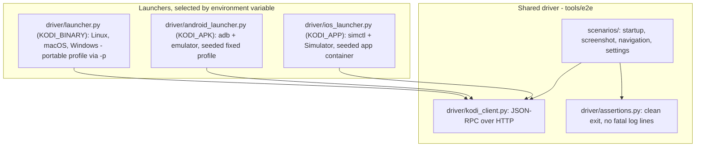

# End-to-End Testing

Kodi's unit tests (`xbmc/test/`, gtest) exercise isolated classes in-process. Nothing
in them starts the application, so regressions in windowing, GL context creation,
settings loading or startup ordering only surface when someone runs a build by hand
on the affected platform. The end-to-end (E2E) suite in [tools/e2e](../tools/e2e)
closes that gap: it builds Kodi from source on GitHub Actions, launches it with a
disposable profile, drives it over JSON-RPC, checks that it renders, and asserts a
clean shutdown, on eight platforms.

This document describes the architecture and the roadmap. How to run the suite and
what each scenario checks is in [tools/e2e/README.md](../tools/e2e/README.md).

## Why JSON-RPC

Kodi already exposes everything a test driver needs, on every platform it runs on:

- The **JSON-RPC API** over HTTP (`xbmc/interfaces/json-rpc/`, methods declared in
  `schema/methods.json`): `GUI.*`, `Input.*`, `Settings.*`, `Player.*`,
  `Application.Quit`, and notifications such as `Player.OnPlay`.
- A **cross-platform screenshot action** (`xbmc/utils/Screenshot.h`, with per-backend
  implementations under `xbmc/rendering/`), reachable through `Input.ExecuteAction`.

So a single Python driver can test every platform. Only the piece that starts and
stops Kodi, and gets a seeded profile onto whatever storage the platform uses, has to
be platform-specific.

## Architecture: one driver, several launchers

- **Scenarios** are plain pytest tests and are shared unmodified across every
  platform. Each gets a running Kodi from the `kodi` fixture in `conftest.py` and
  drives it over JSON-RPC. The fixture's teardown runs `assert_clean_shutdown`,
  which quits Kodi and asserts exit code 0, no platform crash report and no
  fatal-level log lines, unless the scenario already shut Kodi down itself.
- **The client** is a deliberately small request/response JSON-RPC wrapper. When the
  suite needs notifications (waiting for `Player.OnPlay`, for instance), the plan is
  to adopt a maintained WebSocket client such as `jsonrpc-websocket`/`pykodi` rather
  than extend it by hand.
- **Launchers** implement the `KodiInstance` protocol in `driver/instance.py`: start
  Kodi with a profile that has the webserver enabled on a free port, authentication
  disabled, a screenshot directory set and add-on auto-updates off (the
  `GUISETTINGS_TEMPLATE` in `driver/launcher.py`); wait for JSON-RPC to answer;
  expose `screenshot_dir`, `read_log()`, `read_guisettings()`, `wait_for_exit()` and
  `crash_report()`. Desktop Kodi gets that profile through
  `-p`/`--portable`. Android and iOS/tvOS have no such flag, so their launchers seed
  the single fixed profile instead; the Android module docstring explains why that
  is much harder than it sounds on API 30.

## CI

Six workflows, each with a `build` job and an `e2e` job, cover eight platforms:
macOS, Linux GBM, Linux Wayland, Linux X11, Windows, Android (emulator), iOS
(Simulator) and tvOS (Simulator). `build` compiles Kodi (via `tools/depends` where
the platform needs it, against distro packages on Linux, with prebuilt packages on
Windows), runs the unit tests where the platform has them, and uploads what the test
job needs: the Debian packages CPack produces on Linux, the app bundle, exe tree, APK
or Simulator app elsewhere. `e2e` downloads it onto a fresh runner, installs the
packages where there are any, provides a display (vkms, Weston, Xvfb), an emulator or
a Simulator, and runs the suite. On Linux the binary under test is therefore the
installed one, with its profile passed through `KODI_DATA`. The shared steps are composite
actions under `.github/actions/`. Triggers, cache policy and the per-platform details
are documented in [tools/e2e/README.md](../tools/e2e/README.md#ci).

The jobs are not required checks yet. They run on every non-draft PR commit and on
master, and a failure is informational until the suite has proven stable.

## What is covered today

- Startup: the built binary starts and the JSON-RPC webserver answers.
- Rendering: a screenshot of the Home window is a valid image and not blank, which
  catches a GL context that is created successfully but draws nothing.
- Navigation: `GUI.ActivateWindow` and `Input.Back` move between windows.
- Settings: a value changed over JSON-RPC persists to `guisettings.xml`.
- Shutdown: exit code 0 and no fatal log lines, on every scenario.

## What is deliberately not covered yet

- Playback. No fixture media is checked in yet; this is the highest-value gap.
- Visual regression against baselines. Fonts and GL output differ enough between
  runners that a tolerant baseline system (SSIM/pixelmatch plus baseline management)
  is needed first.
- Add-on install/update flows (needs a local mock repository), PVR, UPnP/SMB/NFS
  sources (need mock backends).
- Real GPU drivers and hardware decode: every job renders through software
  rasterisation on an emulator, a Simulator or a virtual display.
- Binary add-ons are not built.
- Android runs on a phone emulator profile, not Android TV, and x86_64 rather than
  arm64.

## Roadmap

1. **Playback smoke suite**: a few seconds each of h264/mp4, hevc/mkv, aac/flac and
   one `.srt`, added as a source; `Player.Open`, poll `Player.GetProperties` for
   `time` advancing, `Player.Stop`. Needs the WebSocket client for notifications.
2. **Library scan**: add the fixture folder as a video source, `VideoLibrary.Scan`,
   wait for `VideoLibrary.OnScanFinished`, assert the item is in the library.
3. **Breadth at low cost**: a window sweep through every top-level window, a
   read-only call per JSON-RPC namespace, a settings round trip per category. See
   [tools/e2e/COVERAGE_MATRIX.md](../tools/e2e/COVERAGE_MATRIX.md) and
   [tools/e2e/TEST_BACKLOG.md](../tools/e2e/TEST_BACKLOG.md).
4. **Visual regression** with a tolerant perceptual diff and checked-in baselines.
5. **OS-chrome automation** on mobile (Appium, Espresso/UIAutomator or XCUITest) for
   what JSON-RPC cannot see: permission dialogs, backgrounding, PiP.
6. **webOS** on LG's emulator if tooling allows, otherwise nightly only.
7. **Hardware in the loop** (Raspberry Pi, Android TV boxes, Apple TV, webOS TVs) on
   self-hosted runners with HDMI capture, weekly rather than per PR, for HW decode,
   HDR, refresh-rate switching and CEC.

## Open decisions

- **Gating**: which jobs become required checks, and whether PR runs should be
  narrowed (label, path filter) once the suite grows beyond a smoke test. Eight full
  builds per PR commit is expensive.
- **Build source**: the `build` jobs could be replaced by artifacts from Kodi's
  existing build infrastructure. The job split keeps that option open, since `e2e`
  only needs the packages or bundle; the Linux legs already consume a `.deb`.
- **Webserver authentication**: the seeded profile disables it. A dedicated test-mode
  flag may be preferable to shipping that configuration path untested.
