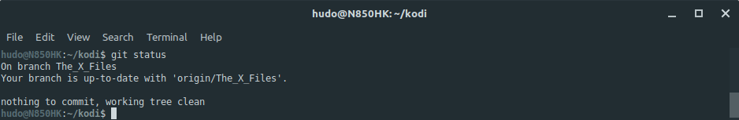
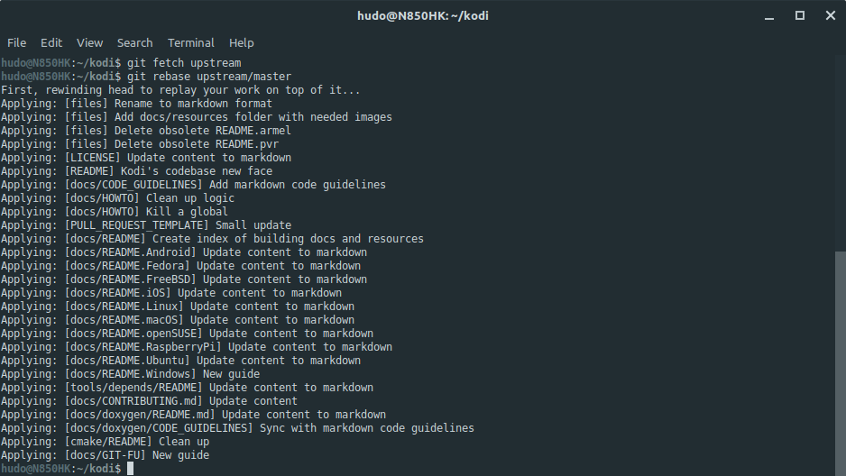
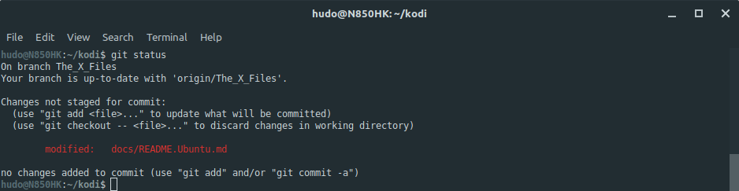
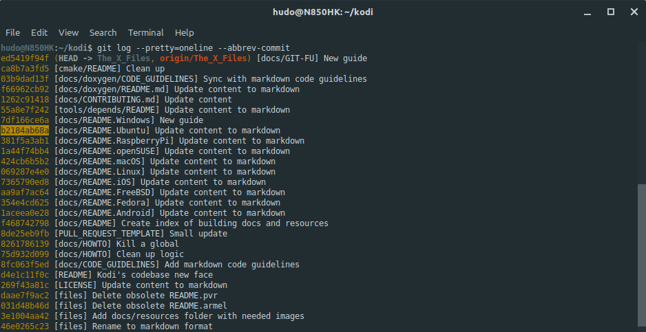
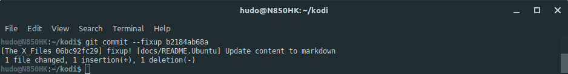
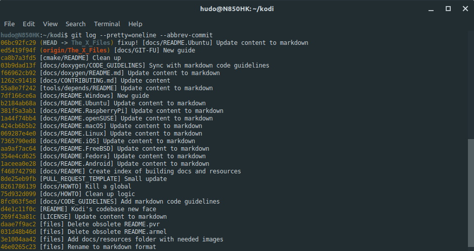
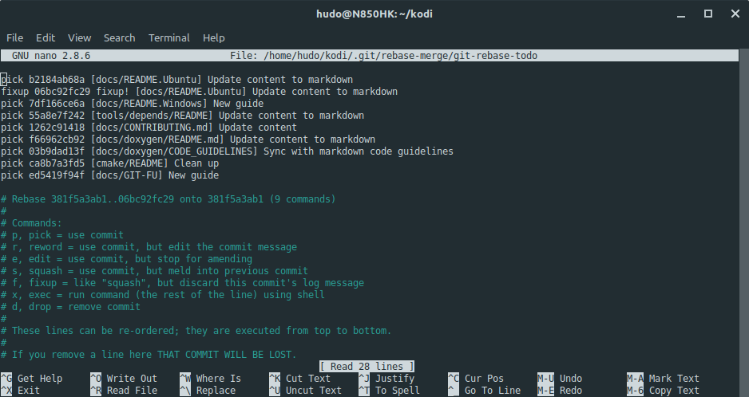
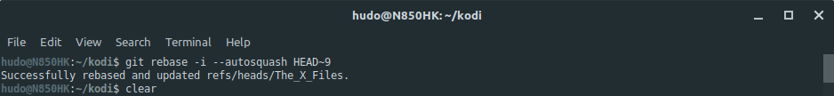
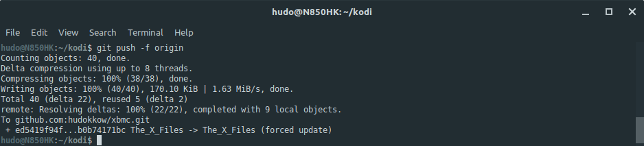

# Kodi's git-fu reference
This guide is intended as a **simple, non-exhaustive, git reference source**. It will help you get acquainted with command-line `git`, even if you never imagined yourself touching the dreaded beast with a 3m pole (that's 10 feet for those across the pound).

It is streamlined to Kodi's **[fork and pull](https://help.github.com/articles/about-collaborative-development-models/)** development workflow: create feature branch, write awesome code, open a pull request, get it reviewed by Kodi team members, merge pull request. Loop!

## Table of Contents
1. **[Introduction](#1-introduction)**
2. **[Document conventions](#2-document-conventions)**
3. **[Prerequisites](#3-prerequisites)**
4. **[Clone Kodi's repo into your machine](#4-clone-kodis-repo-into-your-machine)**
5. **[Working with branches](#5-working-with-branches)**  
  5.1. **[Create feature branch](#51-create-feature-branch)**  
  5.2. **[Push feature branch to origin](#52-push-feature-branch-to-origin)**  
  5.3. **[List branches](#53-list-branches)**  
  5.4. **[Switch between branches](#54-switch-between-branches)**  
  5.5. **[Backup branch](#55-backup-branch)**  
  5.6. **[Check branch status](#56-check-branch-status)**  
  5.7. **[Delete branch](#57-delete-branch)**  
  5.8. **[Rebase branch](#58-rebase-branch)**
6. **[Syncing branches](#6-syncing-branches)**  
  6.1. **[Fetch master branch from upstream and sync local master branch with it](#61-fetch-master-branch-from-upstream-and-sync-local-master-branch-with-it)**  
  6.2. **[Fetch feature branch from origin and sync local feature branch with it](#62-fetch-feature-branch-from-origin-and-sync-local-feature-branch-with-it)**  
  6.3. **[Push local feature branch to origin and sync remote feature branch with it](#63-push-local-feature-branch-to-origin-and-sync-remote-feature-branch-with-it)**
7. **[Working with commits](#7-working-with-commits)**  
  7.1. **[Create commit](#71-create-commit)**  
  7.2. **[Amend last commit](#72-amend-last-commit)**  
  7.3. **[Rename last commit](#73-rename-last-commit)**  
  7.4. **[Delete last commit](#74-delete-last-commit)**  
  7.5. **[Fix commit](#75-fix-commit)**  
  7.6. **[List commits](#76-list-commits)**  
  7.7. **[Cherry-pick commits](#77-cherry-pick-commits)**
8. **[Examples with nice screenies](#8-examples-with-nice-screenies)**  
  8.1. **[Rebase branch](#81-rebase-branch)**  
  8.2. **[Fix commits](#82-fix-commits)**
9. **[Going pro](#9-going-pro)**  
  9.1. **[Fetch an upstream pull request](#91-fetch-an-upstream-pull-request)**  
  9.2. **[Fetch a pull request someone submitted to your repository](#92-fetch-a-pull-request-someone-submitted-to-your-repository)**  
  9.3. **[Fetch a pull request or commit and apply them to another branch](#93-fetch-a-pull-request-or-commit-and-apply-them-to-another-branch)**
10. **[Other resources](#10-other-resources)**  
  10.1. **[Using git alias](#101-using-git-alias)**

## 1. Introduction
**[git](https://en.wikipedia.org/wiki/Git)** is a distributed version control system, originally written by a brilliant, self-described **[bastard](https://lkml.org/lkml/2000/9/6/65)**. It is not the most easy version control system (VCS for short) to work with but it is very intuitive **once** you understand some concepts. Some of the most important ones are outlined below.

* **repository**: a place where files and their versioned history live. Also known as **repo**.
* **upstream**: Kodi's **[main repository](https://github.com/xbmc/xbmc)**. It's where everything you code will end up after review and a pull request (PR for short) is merged.
* **master**: the repository's main branch. It is where all the code integration happens.
* **remote**: the remote location of a repository, usually on some central server. Both Kodi's **main repository** and your **personal repository** are remotes.
* **origin**: your **personal repository**. Everything you code will end up in your personal repository after you `push`. You're master and commander.
* **fork**: create an exact copy of a remote repository, at that point in time, in your personal GitHub account.
* **clone**: grab an exact copy of a remote repository, usually from your personal repository, and place it on your local machine.
* **branch**: a magical place where what you code doesn't interfere with anything else. Think of it as an house compartment. You cook in the kitchen, sleep in the bedroom, have fun with friends while watching football in the living room, etc. Unlike house compartments, they are free and you can have as many as you like.
* **commit**: chunk of code you committed to. You think it's the best code you've ever written, decided to hang on to it and maybe rule the world one day.
* **pull request**: a request for someone to review your code and include it in Kodi's main repository.
* **fetch**: grab code from an outside source, usually from the main repository.
* **push**: send code to a remote repository, usually to your personal repository.
* **merge**: merge a feature branch with another branch, usually master branch.

## 2. Document conventions
This guide assumes you are using `terminal`, also known as `console`, `command-line` or simply `cli`. Commands need to be run at the terminal, one at a time and in the provided order.

This is a comment that provides context:
```
this is a command       // this is an inline comment
this is another command // you should not copy them
and yet another one     // to the terminal
```

**Example:** Clone Kodi's current master branch:
```
git clone https://github.com/xbmc/xbmc kodi
```

Commands that contain strings enclosed in angle brackets denote something you need to change to suit your needs.
```
git clone -b <branch-name> https://github.com/xbmc/xbmc kodi
```

**Example:** Clone Kodi's current Krypton branch:
```
git clone -b Krypton https://github.com/xbmc/xbmc kodi
```

Several different strategies are used to draw your attention to certain pieces of information. In order of how critical the information is, these items are marked as a note, tip, or warning. For example:
 
> [!NOTE]  
> Linux is user friendly... It's just very particular about who its friends are.

> [!TIP]
> Algorithm is what developers call code they do not want to explain.

> [!WARNING]  
> Developers don't change light bulbs. It's a hardware problem.

**[back to top](#table-of-contents)** | **[back to section top](#2-document-conventions)**

## 3. Prerequisites
This guide assumes you have a **[GitHub account](https://github.com/join)** and that you already **[forked Kodi's repository](https://github.com/xbmc/xbmc/fork/)** into it.

It also assumes `git` is installed and an SSH key is **[properly configured](https://help.github.com/articles/connecting-to-github-with-ssh/)**. How to install `git` can be found on our specific OS/distribution **[build guides](README.md)**.

Configure `git` globally so it knows who you are:
```
git config --global user.email "<your-email>"
git config --global user.name "<your-username>"
```

If you're a Windows user you also need:
```
git config --global core.autocrlf true
```

**[back to top](#table-of-contents)**

## 4. Clone Kodi's repo into your machine
Your forked Kodi's repository will hold everything you do when developing. For safety, you should push every branch and commit you make during development to your remote repository (your GitHub's Kodi fork). You should also be careful not to push sensitive data, credentials, etc. Once online, always online.

Clone your personal repository into your machine:
```
cd $HOME                                                 // change to your `home` directory
git clone git@github.com:<github-username>/xbmc.git kodi // clone your fork of Kodi's repo
cd kodi                                                  // change to the newly cloned repo directory
git remote add upstream https://github.com/xbmc/xbmc.git // assign Kodi's main repo to a remote
```

> [!TIP]
> Windows users should use `cd %userprofile%` instead.

From this point forward, every command shown assumes you're inside `$HOME/kodi` or `%userprofile%\kodi` if you're a Windows user. To get there, issue:
```
cd $HOME/kodi // or cd %userprofile%\kodi
```

**[back to top](#table-of-contents)**

## 5. Working with branches
Never ever work on master branch. **Ever!** It will get you and probably us into unnecessary trouble. Always create a feature branch.

### 5.1. Create feature branch
```
git checkout master              // make sure you're on master branch
git checkout -b <feature-branch> // create feature branch
```

### 5.2. Push feature branch to origin
Pushing for the first time:
```
git push --set-upstream origin <feature-branch>
```

Subsequent pushes:
```
git push origin
```

Force pushing:
```
git push -f origin
```

### 5.3. List branches
List local branches:
```
git branch
```

List local and remote branches:
```
git branch -a
```

### 5.4. Switch between branches
```
git checkout <feature-branch> // switch to feature branch
git checkout master           // switch back to master branch
```

### 5.5. Backup branch
```
git checkout <feature-branch>           // switch to feature branch (the branch you want to backup)
git checkout -b <feature-branch>-backup // create a new branch based on feature branch
git checkout <feature-branch>           // switch back to feature branch
```

### 5.6. Check branch status
Shows branch name, status in relation to remote origin branch, unstaged changes, etc:
```
git status
```

### 5.7. Delete branch
Delete local branch:
```
git checkout master             // make sure you're not on feature branch to delete
git branch -D <feature-branch>  // delete feature branch
```

Delete remote branch:
```
git push origin -d <feature-branch>
```

> [!WARNING]  
> Be careful deleting branches. Make sure you don't need them anymore.

### 5.8. Rebase branch
```
git checkout <feature-branch>  // switch to feature branch in need of rebasing
git fetch upstream             // fetch upstream changes
git rebase upstream/master     // rebase feature branch on top of upstream master branch
git push -f origin             // force push updated feature branch to your personal remote repo
```

**NOTE**: If you have a **pull request** open from that feature branch, this will also update it.

**[back to top](#table-of-contents)** | **[back to section top](#5-working-with-branches)**

## 6. Syncing branches
Keeping branches up-to-date is an excellent base for successful, stress-free coding. You should always start coding a new feature on top of the latest master branch. If you work on more than one machine, this also ensures your feature branch is always up-to-date with the latest changes.

### 6.1. Fetch master branch from upstream and sync local master branch with it
If you cloned a while ago, you probably want to sync your local master branch with upstream's master branch. This is specially useful to ensure that your new feature branch is based on the latest code version:
```
git checkout master       // switch to master branch
git fetch upstream        // fetch upstream changes
git merge upstream/master // merge upstream changes
git push origin           // push updated master branch to your personal remote repo (optional)
```

### 6.2. Fetch feature branch from origin and sync local feature branch with it
```
git checkout <feature-branch>            // switch to feature branch
git fetch origin                         // fetch origin changes
git reset --hard origin/<feature-branch> // reset feature branch
```

### 6.3. Push local feature branch to origin and sync remote feature branch with it
```
git checkout <feature-branch> // switch to feature branch
git push origin               // push updated feature branch to your personal remote repo
```

> [!WARNING]  
> Be **very careful** updating to and from origin. It can cause loss of work, specially if you work on more than one machine. Make sure your remote origin repo **always** holds the most up-to-date version of your code. **No, seriously**. Make a mental rule: *remote origin repo always holds the most up-to-date version of my code!* and **stick to it!** It's almost always possible to recover lost work with `git` but it's hard and unnecessary work if you follow some simple rules.

**[back to top](#table-of-contents)** | **[back to section top](#6-syncing-branches)**

## 7. Working with commits
All commit manipulating operations (commit, amend or fix a commit, etc.), start by adding your changes before committing:
```
git add path/to/file/filename // add single file
git add .                     // add all files on current directory
git add *                     // add all files in current directory and subdirectories
```

### 7.1. Create commit
```
git commit -m "<commit-description>"
```

### 7.2. Amend last commit
```
git commit --amend
```

### 7.3. Rename last commit
```
git commit --amend // change commit message in your editor and save
```

### 7.4. Delete last commit
Delete last commit but keep all the changes it encompasses:
```
git reset HEAD~
```

Delete last commit, **including all the changes** it encompasses:
```
git reset --hard HEAD~
```

### 7.5. Fix commit
```
git commit --fixup <commit-sha>
```

### 7.6. List commits
```
git log --pretty=oneline --abbrev-commit
```

### 7.7. Cherry-pick commits
```
git checkout <feature-branch>            // switch to branch with commit(s) you want to cherry-pick
git log --pretty=oneline --abbrev-commit // list commits. take note of the commit(s) `sha`
git checkout <other-feature-branch>      // switch to branch that will receive cherry-picked commit(s)
git cherry-pick <sha>                    // cherry-pick commit
git cherry-pick <sha>                    // cherry-pick another commit
git cherry-pick <sha>                    // you get the point
```

**[back to top](#table-of-contents)** | **[back to section top](#7-working-with-commits)**

## 8. Examples with nice screenies
A picture is worth a thousand words.

### 8.1. Rebase branch

Check if branch is clean and has no uncommitted changes:


Fetch upstream changes and rebase feature branch on top of upstream master branch:


Force push branch to remote origin:


**[back to top](#table-of-contents)** | **[back to section top](#8-examples-with-nice-screenies)** | **[back to subsection top](#81-rebase-branch)**

### 8.2. Fix commits

Check unstaged changes:


Add changes and check again:


Print a nice commits log and copy `b2184ab68a`, the `sha` of the commit we want to fix:


Commit the changes with `git commit --fixup b2184ab68a` to reference the commit in need of fixing:


Check if everything is OK and count how many commits we need to use for an `autosquash` rebase (we need nine commits because commit in need of fixing is the ninth commit, including the `fixup` commit):


Due to the nature of the `git rebase -i --autosquash HEAD~9` command (opens editor right away), command doesn't show up on this screenshot. See next screenshot.
How it looks after `git` re-orders commits automagically:


**NOTE**: These examples use `nano` as default `git` editor to keep things simple. Press `Ctrl+X` to exit and accept the changes.

A successful message after rebase with `autosquash`:


Finally, force push branch to remote origin:


**TIP**: It doesn't matter how many `fixup` commits you have on your feature branch. The only thing that matters is the number of the **first** commit with a `fixup` commit. If you're unsure of how many commits that is, issue `git log --pretty=oneline --abbrev-commit`, count from your **first commit** on the feature branch and use that number instead. In this example, that would be 28, e.g. `git rebase -i --autosquash HEAD~28`. `git` will take care of the rest automagically.

**[back to top](#table-of-contents)** | **[back to section top](#8-examples-with-nice-screenies)** | **[back to subsection top](#82-fix-commits)**

## 9. Going pro
Got this far? Congrats! Now it gets fun!

### 9.1. Fetch an upstream pull request
The ability to test pull requests before merging them is very useful. This is how to do it:
```
git fetch upstream pull/<pull-request-ID>/head:<branch-name-or-pull-request-ID-or-whatever>
git checkout <branch-name-or-pull-request-ID-or-whatever>
```

Build Kodi as usual, following our **[build guides](README.md)**.

### 9.2. Fetch a pull request someone submitted to your repository
Yes, someone might open a pull request to your repository. Be happy that folks want to work with you.

Same thing as above except that `upstream` is now `origin`. They are both remote repositories, remember?
```
git fetch origin pull/<pull-request-ID>/head:<branch-name-or-pull-request-ID-or-whatever>
git checkout <branch-name-or-pull-request-ID-or-whatever>
```

**TIP**: Every pull request has an unique ID. For instance, the original pull request for this guide is **[PR14072](https://github.com/xbmc/xbmc/pull/14072)**. Its ID is **14072**.

If you want to try it, issue:
```
git fetch upstream pull/14072/head:PR14072 // branch name can be anything
git checkout PR14072                       // switch to branch
```

and see the original version of this documentation in all its glorious might.

### 9.3. Fetch a pull request or commit and apply them to another branch
Also very useful is the ability to fetch a complete pull request or a single commit and apply it to your **current** branch, instead of creating a new branch like the method outlined above.

Similarly to the method above, find the PR you want to fetch, **[PR14072](https://github.com/xbmc/xbmc/pull/14072)** for instance, and append `.patch` to the URL. GitHub will generate a formatted patch and show you the output. Copy that URL and choose your next move below.

Apply the changes to your branch but do not commit them (changes will be kept unstaged):
```
curl -L https://patch-diff.githubusercontent.com/raw/xbmc/xbmc/pull/14072.patch | git apply -
```

Apply the changes to your branch with the original commit(s) message(s):
```
curl -L https://patch-diff.githubusercontent.com/raw/xbmc/xbmc/pull/14072.patch | git am -
```

The same tricks work for a single commit. Just find a commit you'd like to fetch, **[[README] Kodi's codebase new face](https://github.com/xbmc/xbmc/pull/14072/commits/bb62d22f0d62b20ebc2325f7820a37759839efe0)** for instance, append `.patch` to the URL and follow the instructions above.

**[back to top](#table-of-contents)** | **[back to section top](#9-going-pro)**

## 10. Other resources
`git` is an incredibly powerful VCS. It's next to impossible to document everything it can do because it's so versatile, many tasks can be achieved in more than one way, and what works for a developer might not work for another. How one uses it heavily depends on the implemented workflow and, to some extent, personal taste. With that in mind, below are listed some external git resources worth a look with many exotic examples. Some you might only need once in a lifetime.

* **[git-tips](https://github.com/git-tips/tips)**
* **[git-cheat-sheet](https://github.com/arslanbilal/git-cheat-sheet)**

### 10.1. Using git alias
Aliases are a great `git` feature. Instead of typing - and remembering - a long and boring command, one can instruct `git` to perform an action with a much shorter command. Hence the name aliases.

The command to add an alias to `git` is simple: `git config --global --add alias.<alias> <command>`.

For example, add an alias `st` to `status`:
```
git config --global --add alias.st status
```

Now you can just type `git st` instead of `git status`. Saves you a mammoth four keystrokes.

Some of my favorite aliases are:

`slog` instead of `log --pretty=oneline --abbrev-commit`:
```
git config --global --add alias.slog "log --pretty=oneline --abbrev-commit"
```

`ema` instead of `cherry-pick`:
```
git config --global --add alias.ema cherry-pick
```

`lg` instead of `log --graph --pretty=format:'%Cred%h%Creset -%C(yellow)%d%Creset %s %Cgreen(%cr) %C(bold blue)<%an>%Creset' --abbrev-commit --date=relative`:
```
git config --global --add alias.lg "log --graph --pretty=format:'%Cred%h%Creset -%C(yellow)%d%Creset %s %Cgreen(%cr) %C(bold blue)<%an>%Creset' --abbrev-commit --date=relative"

```

`fix` instead of `commit --fixup`:
```
git config --global --add alias.fix "commit --fixup" // git fix <commit-sha>
```

`fixer` instead of `rebase -i --autosquash`:
```
git config --global --add alias.fixer "rebase -i --autosquash" // git fixer HEAD~10 will autosquash the last 10 commits
```

**[back to top](#table-of-contents)** | **[back to section top](#10-other-resources)**

