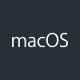
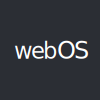
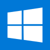

# Kodi's Documentation Home
Welcome to Kodi's documentation home. Geared at developers, it contains platform specific build guides, **[code guidelines](CODE_GUIDELINES.md)**, a **[git guide](GIT-FU.md)** streamlined for Kodi's workflow and Doxygen's resources, ready to generate **[code documentation](doxygen/README.md)**.

If you haven't done so, we encourage you to read our **[contributing guide](CONTRIBUTING.md)** first. It contains pertinent information about our development model.

## Building Kodi
Kodi uses CMake as its building system but instructions are highly dependent on your operating system and target platform. Choose your platform below and read the guide carefully before proceeding.

  
  
  
  
  
  
  
  
  
  
  

